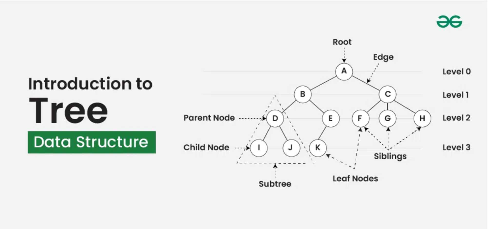
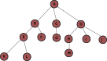
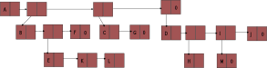
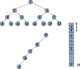

# Tree

## Definition

> A tree is a finite set of one or more nodes such that
> 1. There is specially designated node called the root
> 2. The remaining Nodes are partitioned into n >= 0  
>    disjoint set T1, ... Tn, where each of these sets is a tree 
>3. T1, ...,Tn are called the subtree of the root

## Term
- 
- **Node**  : item of information plus the branches to other Node
- **Degree**  : number of subtree
- **Degree of a tree**  : Maximum of the degree of the nodes in the tree
- **Leaf**/**Terminal**  : Nodes that have degree of zero
- **Children**  : The roots of subtrees of a node X are the children of X 
- **Parent**  : X is the parent of its children
- **Sibling**  : Children of the same parent are said to be siblings
- **Ancestors of a Node**  : All the node along the path from root to that Node
- **level**  : root is level 1/or 0
- **height/depth of a tree**  : Maximum level of any node in the tree

## Representation of Trees
- 

### List Represenatation

* 
   - Explain
   - A have 3 child, create 3 node, each child have child, go down.
   - Put A last child to 0
   - B have 2 child, create 2 node
   - B first child E have child, go down
   - E have 2 child, create 2 node
   - ... so on 

* LIST decode
   1. A(B,C,D)
   2. A(B(E,F),C(G),D(H,I,J))
   3. A(B(E(K,L),F), C(G) , D(H(M),I,J))

* Possible **A NODE** structure for tree of degree K   
   -   

### TODO NEED REFERENCE CHECK
* **IMPORTANT PROOF**
   - Since 

### Linked list tree implement

ADT function: A Linked list tree is require as following method
1.  Read  
    A(B(E(K,L),F), C(G) , D(H(M),I,J)) As a numerical tree represent, return root of tree pointer
2.  Write  
   Giving a tree pointer, output to numerical represent as above
3.  Revert
4.  Copy
5.  

## Binary_Tree

> - **OBJECT** : A finite set of nodes either empty or consisting of root node, left Binary_Tree, and right Binary_Tree  

### TODO SHOW DIFFERENT Bin_Tree

### Important Note

* The maximum number of nodes on level i of a binary tree is 2^i-1, i >= 1
   1. root -> level i = 1 (set root as level 1)  
      maximum of nodes on level i = 1 is  2^i-1 = 2^0 = 1
   2. Let i be positive number > 1,  
      maximum number of nodes on level i-1 is 2^i-2
   3. Each node in binary tree has maximum degree of 2,  
      nodes on level i is two times maximum numbder nodes then i-1-> . 
      2^i-     1
* The maximum number of nodes in a binary tree of depth k is 2^k - 1, k >=1
#### Array representation of Binary tree
- 